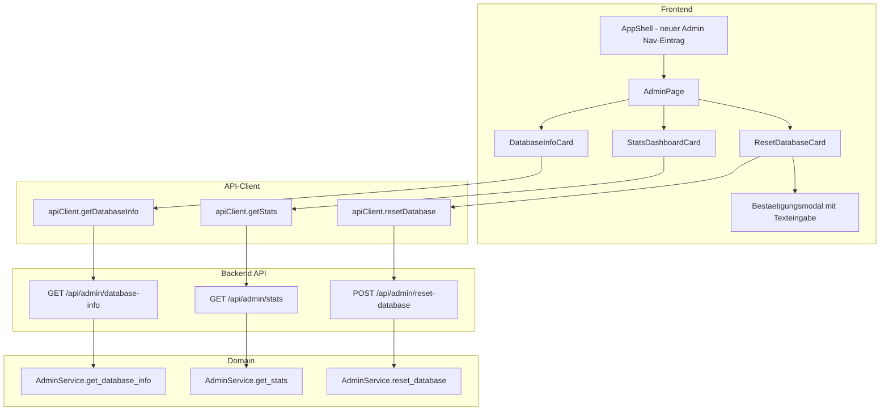
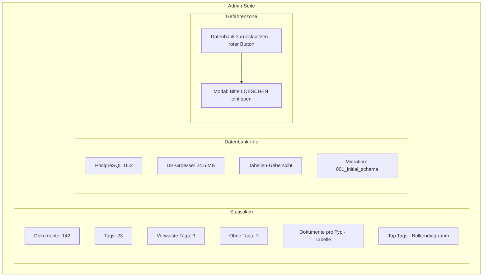

# Admin-Seite – Plan

## Uebersicht

Eine Admin-Seite fuer DocArchiv mit drei Funktionen:

1. **Datenbank zuruecksetzen** – Alle Daten loeschen mit Sicherheitsbestaetigung
2. **Statistik-Dashboard** – Uebersicht ueber Dokumente, Tags und Verteilungen
3. **Datenbank-Info** – Technische Infos zu DB-Groesse, Tabellenstatistiken, Migrationsstand

## Architektur



## Backend

### 1. Neue Datei: `backend/api/admin.py`

Admin-Router mit drei Endpunkten:

| Methode | Pfad | Beschreibung |
|---------|------|-------------|
| `POST` | `/api/admin/reset-database` | Loescht alle Daten aus documents, tags, document_tags |
| `GET` | `/api/admin/stats` | Liefert Statistiken |
| `GET` | `/api/admin/database-info` | Liefert DB-Metadaten |

### 2. Erweiterung: `backend/domain/services.py`

Neuer `AdminService` mit folgenden Methoden:

#### `reset_database()`
- Fuehrt `TRUNCATE documents, tags, document_tags CASCADE` aus
- Gibt Erfolgsmeldung zurueck
- Loggt die Aktion mit WARNING-Level

#### `get_stats()` → `AdminStatsResponse`
- Gesamtanzahl Dokumente
- Gesamtanzahl Tags
- Dokumente pro Typ (dict)
- Dokumente pro Monat (letzte 12 Monate)
- Top-10 Tags nach Dokumentanzahl
- Anzahl Dokumente ohne Tags
- Anzahl Tags ohne Dokumente (verwaist)

#### `get_database_info()` → `DatabaseInfoResponse`
- Datenbankgroesse (pg_database_size)
- Tabellengroessen (pg_total_relation_size)
- Zeilenanzahl pro Tabelle
- Aktuelle Alembic-Revision
- PostgreSQL-Version

### 3. Erweiterung: `backend/domain/schemas.py`

Neue Pydantic-Schemas:

```python
class AdminStatsResponse(BaseModel):
    total_documents: int
    total_tags: int
    documents_by_type: dict[str, int]
    documents_by_month: list[MonthCount]
    top_tags: list[TagCount]
    documents_without_tags: int
    orphaned_tags: int

class MonthCount(BaseModel):
    month: str  # Format: "2025-01"
    count: int

class TagCount(BaseModel):
    name: str
    count: int

class DatabaseInfoResponse(BaseModel):
    database_size: str
    tables: list[TableInfo]
    alembic_revision: str | None
    postgres_version: str

class TableInfo(BaseModel):
    name: str
    row_count: int
    size: str

class ResetDatabaseResponse(BaseModel):
    message: str
    deleted_documents: int
    deleted_tags: int
```

### 4. Erweiterung: `backend/api/dependencies.py`

Neue Dependency `get_admin_service` und `AdminServiceDep`.

### 5. Erweiterung: `backend/main.py`

Admin-Router registrieren:
```python
from api.admin import router as admin_router
app.include_router(admin_router, prefix=settings.api_prefix)
```

### 6. Tests: `backend/tests/test_admin.py`

- Test: Reset-Endpunkt loescht alle Daten
- Test: Stats liefert korrekte Zahlen
- Test: Database-Info liefert erwartete Felder

## Frontend

### 1. Navigation erweitern: `frontend/src/components/layout/AppShell.tsx`

- Neuer Nav-Eintrag "Admin" mit `IconSettings` Icon in der Bottom-Navigation
- Neuer `activeNavItem`-Wert: `'admin'`
- Wenn `admin` aktiv ist, wird `AdminPage` statt `HomePage` gerendert

### 2. Neue Datei: `frontend/src/pages/AdminPage.tsx`

Hauptseite mit drei Karten/Sektionen in einem `Stack`:
- `ResetDatabaseCard`
- `StatsDashboardCard`
- `DatabaseInfoCard`

### 3. Neue Datei: `frontend/src/components/admin/ResetDatabaseCard.tsx`

- Karte mit Warnsymbol und Beschreibung
- Roter "Datenbank zuruecksetzen"-Button
- Bei Klick oeffnet sich ein Modal:
  - Warntext: "Diese Aktion loescht ALLE Dokumente und Tags unwiderruflich."
  - Texteingabe: User muss "LÖSCHEN" eintippen
  - Button wird erst aktiv wenn Eingabe korrekt ist
  - Nach Erfolg: Erfolgsmeldung mit Anzahl geloeschter Eintraege
  - Danach: Automatischer Reload der Hauptdaten

### 4. Neue Datei: `frontend/src/components/admin/StatsDashboardCard.tsx`

- Gesamtzahlen als Stat-Karten (Dokumente, Tags, Verwaiste Tags, Dokumente ohne Tags)
- Dokumente pro Typ als einfache Liste/Tabelle
- Top-10 Tags als horizontale Balken (reine CSS-Balken, keine Chart-Library)
- Dokumente pro Monat als einfache Tabelle

### 5. Neue Datei: `frontend/src/components/admin/DatabaseInfoCard.tsx`

- PostgreSQL-Version
- Datenbankgroesse
- Tabelle mit: Tabellenname, Zeilenanzahl, Groesse
- Alembic-Migrationsstand

### 6. Erweiterung: `frontend/src/api/client.ts`

Neue Methoden im `apiClient`:
```typescript
resetDatabase(): Promise<ResetDatabaseResponse>
getAdminStats(): Promise<AdminStatsResponse>
getDatabaseInfo(): Promise<DatabaseInfoResponse>
```

### 7. Neue Datei: `frontend/src/hooks/useAdmin.ts`

Custom Hook der:
- Stats und DB-Info beim Mounten laedt
- `resetDatabase()` Funktion bereitstellt
- Loading/Error-States verwaltet
- Nach Reset automatisch Stats neu laedt

### 8. Erweiterung: `frontend/src/types/document.ts`

Neue TypeScript-Interfaces:
- `AdminStatsResponse`
- `DatabaseInfoResponse`
- `ResetDatabaseResponse`
- `MonthCount`
- `TagCount`
- `TableInfo`

## UI-Mockup



## Design-Richtlinien

- Gleiches Dark-Theme wie der Rest der App (Navy/Gold)
- Gefahrenzone: Roter Rahmen/Hintergrund fuer den Reset-Bereich
- Statistiken: Gold-Akzentfarbe fuer Zahlen
- Mantine-Komponenten: `Card`, `Modal`, `TextInput`, `Button`, `Table`, `SimpleGrid`, `Progress`
- Responsive: Auf Mobile einspaltiges Layout

## Reihenfolge der Implementierung

1. Backend: Schemas definieren
2. Backend: AdminService implementieren
3. Backend: Admin-Router erstellen und registrieren
4. Backend: Tests schreiben
5. Frontend: Types erweitern
6. Frontend: API-Client erweitern
7. Frontend: useAdmin Hook
8. Frontend: Admin-Komponenten (ResetCard, StatsCard, DBInfoCard)
9. Frontend: AdminPage zusammenbauen
10. Frontend: Navigation erweitern
