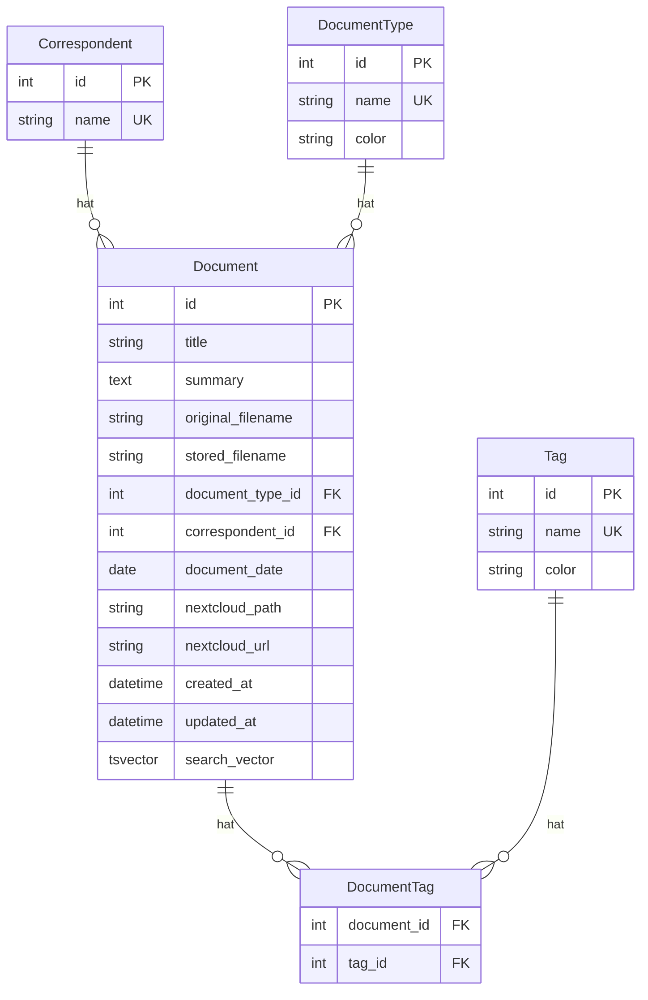

# Plan: Korrespondent & Dokumenttyp normalisieren

## Zusammenfassung

Das Datenmodell wird um eine eigene `Correspondent`-Tabelle erweitert und `document_type` wird von einem Freitext-String in eine eigene `DocumentType`-Tabelle normalisiert. Beide Entitaeten erhalten vollstaendige CRUD-Endpunkte, werden in die Volltextsuche integriert und im Admin-Dashboard als Statistiken angezeigt.

**Breaking Change:** Die initiale Alembic-Migration wird neu geschrieben. Keine Datenmigration noetig (nur Demo-Daten vorhanden).

## Ziel-Datenmodell

### Aenderungen gegenueber Ist-Zustand

| Aenderung | Vorher | Nachher |
|---|---|---|
| Korrespondent | nicht vorhanden | Eigene `correspondents`-Tabelle, 1:N auf `documents` |
| Dokumenttyp | `document_type` als `String 100` auf `documents` | Eigene `document_types`-Tabelle, 1:N auf `documents` via `document_type_id` FK |
| Volltextsuche | `title`, `summary`, `original_filename` | Zusaetzlich: Korrespondent-Name und Dokumenttyp-Name via Subquery/Trigger |

---

## Betroffene Dateien und Aenderungen

### Backend – Domain-Schicht

#### `backend/domain/models.py`
- **Neue Klasse `Correspondent`:** `id`, `name` (unique), Relationship `documents`
- **Neue Klasse `DocumentType`:** `id`, `name` (unique), `color` (optional), Relationship `documents`
- **`Document` aendern:**
  - `document_type: String(100)` entfernen
  - `document_type_id: FK -> document_types.id` hinzufuegen (nullable=False)
  - `correspondent_id: FK -> correspondents.id` hinzufuegen (nullable=True, da nicht jedes Dokument einen Korrespondenten hat)
  - Relationships `document_type_rel` und `correspondent` hinzufuegen (lazy="joined" fuer 1:N)
  - `search_vector` Computed-Ausdruck erweitern: Korrespondent-Name und Dokumenttyp-Name einbeziehen. Da diese in separaten Tabellen liegen, muss der Computed-Ausdruck durch einen Trigger ersetzt werden, oder die Namen werden als denormalisierte Felder gefuehrt. **Empfehlung:** Trigger-basierter Ansatz in der Migration, oder alternativ den search_vector im Application-Layer pflegen.

**Hinweis zum search_vector:** Da PostgreSQL Computed Columns keine Subqueries unterstuetzen, gibt es zwei Optionen:
1. **Option A – Trigger:** Ein DB-Trigger aktualisiert den `search_vector` bei INSERT/UPDATE auf `documents` sowie bei UPDATE auf `correspondents`/`document_types`. Sauberste Loesung.
2. **Option B – Application-Layer:** Der `search_vector` wird beim Erstellen/Aktualisieren im Service berechnet und als normales Feld gespeichert. Einfacher, aber weniger robust.

**Empfehlung:** Option A (Trigger) in der Alembic-Migration.

#### `backend/domain/schemas.py`
- **Neue Schemas:** `CorrespondentBase`, `CorrespondentCreate`, `CorrespondentUpdate`, `CorrespondentResponse`
- **Neue Schemas:** `DocumentTypeBase`, `DocumentTypeCreate`, `DocumentTypeUpdate`, `DocumentTypeResponse`
- **`DocumentBase` aendern:** `document_type: str` ersetzen durch `document_type_id: int`; neues Feld `correspondent_id: int | None = None`
- **`DocumentCreate` aendern:** `document_type` -> `document_type_id`, neues Feld `correspondent_id`
- **`DocumentUpdate` aendern:** `document_type` -> `document_type_id | None`, neues Feld `correspondent_id | None`
- **`DocumentResponse` aendern:** Statt `document_type: str` jetzt `document_type: DocumentTypeResponse` (nested); neues Feld `correspondent: CorrespondentResponse | None`
- **`DocumentListResponse` aendern:** Analog zu `DocumentResponse`
- **`DocumentQueryParams` aendern:** `document_type: str | None` -> `document_type_id: int | None`; neues Feld `correspondent_id: int | None`
- **`AdminStatsResponse` aendern:** `documents_by_type: dict[str, int]` -> `documents_by_type: list[TypeCount]` (neues Schema mit name + count); neues Feld `total_correspondents: int`, `top_correspondents: list[CorrespondentCount]`, `documents_without_correspondent: int`
- **Neue Schemas:** `TypeCount`, `CorrespondentCount`

#### `backend/domain/services.py`
- **Neue Klasse `CorrespondentService`:** CRUD analog zu `TagService`
- **Neue Klasse `DocumentTypeService`:** CRUD analog zu `TagService`
- **Neue Fehlerklassen:** `CorrespondentNotFoundError`, `DocumentTypeNotFoundError`
- **`DocumentService` aendern:**
  - `create_document()`: `document_type_id` und `correspondent_id` statt Freitext verarbeiten
  - `update_document()`: Analog
  - `list_document_types()` entfernen (wird durch `DocumentTypeService.list_document_types()` ersetzt)
- **`AdminService.get_stats()` aendern:**
  - `documents_by_type` Query anpassen (JOIN auf `document_types`)
  - Neue Statistiken: `total_correspondents`, `top_correspondents`, `documents_without_correspondent`
- **`AdminService.reset_database()` aendern:** TRUNCATE um `correspondents` und `document_types` erweitern
- **`AdminService._count_table_rows()` aendern:** `allowed_tables` um `correspondents` und `document_types` erweitern

### Backend – Infrastructure-Schicht

#### `backend/infrastructure/repositories.py`
- **Neue Klasse `CorrespondentRepository`:** `get_by_id`, `get_by_name`, `get_or_create`, `list_with_document_counts`, `create`, `update`, `delete`
- **Neue Klasse `DocumentTypeRepository`:** `get_by_id`, `get_by_name`, `get_or_create`, `list_with_document_counts`, `create`, `update`, `delete`
- **`DocumentRepository` aendern:**
  - `list_documents()`: Filter `document_type` -> `document_type_id`; neuer Filter `correspondent_id`
  - `_build_filters()`: Analog anpassen
  - `list_document_types()` entfernen
  - `selectinload` / `joinedload` fuer `document_type_rel` und `correspondent` hinzufuegen

### Backend – API-Schicht

#### `backend/api/correspondents.py` (NEU)
- CRUD-Router: `GET /correspondents`, `POST /correspondents`, `GET /correspondents/{id}`, `PATCH /correspondents/{id}`, `DELETE /correspondents/{id}`
- Analog zu `backend/api/tags.py`

#### `backend/api/document_types.py` (NEU)
- CRUD-Router: `GET /document-types`, `POST /document-types`, `GET /document-types/{id}`, `PATCH /document-types/{id}`, `DELETE /document-types/{id}`
- Analog zu `backend/api/tags.py`

#### `backend/api/documents.py`
- `list_documents()`: Query-Parameter `type` -> `document_type_id: int | None`; neuer Parameter `correspondent_id: int | None`
- `list_document_types()` Endpunkt entfernen (ersetzt durch eigenen Router)

#### `backend/api/dependencies.py`
- Neue Dependencies: `get_correspondent_service`, `get_document_type_service`
- Neue Type-Aliases: `CorrespondentServiceDep`, `DocumentTypeServiceDep`
- `get_document_service()`: Zusaetzlich `CorrespondentRepository` und `DocumentTypeRepository` injizieren falls noetig

#### `backend/main.py`
- Neue Router einbinden: `correspondents.router`, `document_types.router`

### Backend – Migration

#### `backend/alembic/versions/001_initial_schema.py`
- Komplett neu schreiben mit:
  - `correspondents`-Tabelle
  - `document_types`-Tabelle
  - `documents`-Tabelle mit `document_type_id` FK und `correspondent_id` FK
  - `tags`-Tabelle (unveraendert)
  - `document_tags`-Tabelle (unveraendert)
  - Trigger-Funktion fuer `search_vector` (aktualisiert bei INSERT/UPDATE auf documents)
  - Trigger auf `correspondents` und `document_types` fuer Kaskaden-Update des search_vector

### Backend – Tests

#### `backend/tests/conftest.py`
- `FakeDocumentService` anpassen: `document_type` -> `document_type_id` / nested `DocumentTypeResponse`; `correspondent` hinzufuegen
- Neue Fake-Services: `FakeCorrespondentService`, `FakeDocumentTypeService`
- `client`-Fixture: Neue Dependency-Overrides

#### `backend/tests/test_documents.py`
- Alle Tests anpassen: `document_type: "Rechnung"` -> `document_type_id: 1` etc.
- Neue Tests fuer Korrespondent-Filter

#### `backend/tests/test_correspondents.py` (NEU)
- CRUD-Tests analog zu `test_tags.py`

#### `backend/tests/test_document_types.py` (NEU)
- CRUD-Tests analog zu `test_tags.py`

#### `backend/tests/test_admin.py`
- Statistik-Tests um neue Felder erweitern

---

### Frontend – Types

#### `frontend/src/types/document.ts`
- **Neues Interface `Correspondent`:** `id`, `name`, `document_count`
- **Neues Interface `DocumentTypeInfo`:** `id`, `name`, `color`, `document_count`
- **`DocumentSummary` aendern:** `document_type: string` -> `document_type: DocumentTypeInfo`; neues Feld `correspondent: Correspondent | null`
- **`DocumentFormValues` aendern:** `document_type: string` -> `document_type_id: number`; neues Feld `correspondent_id: number | null`
- **`DocumentListQuery` aendern:** `type?: string` -> `document_type_id?: number`; neues Feld `correspondent_id?: number`
- **`AdminStatsResponse` aendern:** `documents_by_type` Typ anpassen; neue Felder `total_correspondents`, `top_correspondents`, `documents_without_correspondent`
- **Neue Interfaces:** `CreateCorrespondentPayload`, `UpdateCorrespondentPayload`, `CreateDocumentTypePayload`, `UpdateDocumentTypePayload`, `CorrespondentCount`
- **`ResetDatabaseResponse` aendern:** Neue Felder `deleted_correspondents`, `deleted_document_types`

### Frontend – API-Client

#### `frontend/src/api/client.ts`
- Neue Methoden: `listCorrespondents`, `createCorrespondent`, `getCorrespondent`, `updateCorrespondent`, `deleteCorrespondent`
- Neue Methoden: `listDocumentTypes`, `createDocumentType`, `getDocumentType`, `updateDocumentType`, `deleteDocumentType`
- `listDocumentTypes()` aendern: Rueckgabetyp von `string[]` auf `DocumentTypeInfo[]`
- `toQueryString()`: `type` -> `document_type_id`; neuer Parameter `correspondent_id`

### Frontend – Hooks

#### `frontend/src/hooks/useCorrespondents.ts` (NEU)
- Analog zu `useTags.ts`: Laden, Erstellen, Aktualisieren, Loeschen von Korrespondenten

#### `frontend/src/hooks/useDocumentTypes.ts` (NEU)
- Analog zu `useTags.ts`: Laden, Erstellen, Aktualisieren, Loeschen von Dokumenttypen

#### `frontend/src/hooks/useDocuments.ts`
- Query-Typ-Aenderungen durchziehen

### Frontend – Komponenten

#### `frontend/src/components/search/FilterSidebar.tsx`
- `documentType: string` -> `documentTypeId: number | null` in `FilterValues`
- TextInput fuer Dokumenttyp ersetzen durch Select/Autocomplete mit Daten aus `useDocumentTypes`
- Neues Select/Autocomplete fuer Korrespondent mit Daten aus `useCorrespondents`

#### `frontend/src/components/documents/DocumentCard.tsx`
- `document.document_type` ist jetzt ein Objekt -> `document.document_type.name` verwenden
- `document.document_type.color` fuer Farbgebung nutzen (statt hardcoded `getTypeVisuals`)
- Korrespondent-Badge anzeigen falls vorhanden

#### `frontend/src/components/documents/DocumentDetail.tsx`
- `document.document_type` -> `document.document_type.name`
- Neuer Abschnitt: Korrespondent anzeigen

#### `frontend/src/components/admin/StatsDashboardCard.tsx`
- Neue Statistik-Kacheln: `total_correspondents`, `documents_without_correspondent`
- Top-Korrespondenten als Balkendiagramm (analog zu Top-Tags)
- `documents_by_type` Tabelle anpassen (kommt jetzt als Liste statt Dict)

#### `frontend/src/pages/HomePage.tsx`
- Props/State fuer Korrespondenten und Dokumenttypen durchreichen

#### `frontend/src/App.tsx`
- Neue Hooks einbinden und Daten an Komponenten weiterreichen

---

## Umsetzungsreihenfolge

Die Implementierung erfolgt in dieser Reihenfolge, um jederzeit einen kompilierbaren Stand zu haben:

1. **Backend Domain-Models** – `Correspondent`, `DocumentType` Klassen; `Document` anpassen
2. **Backend Alembic-Migration** – `001_initial_schema.py` komplett neu schreiben inkl. Trigger
3. **Backend Schemas** – Alle Pydantic-Schemas fuer Correspondent, DocumentType; bestehende anpassen
4. **Backend Repositories** – `CorrespondentRepository`, `DocumentTypeRepository`; `DocumentRepository` anpassen
5. **Backend Services** – `CorrespondentService`, `DocumentTypeService`; `DocumentService` und `AdminService` anpassen
6. **Backend API-Endpunkte** – Neue Router; bestehende anpassen; Dependencies erweitern; `main.py` Router einbinden
7. **Backend Tests** – Alle Test-Dateien und Fixtures anpassen; neue Test-Dateien
8. **Frontend Types** – `document.ts` komplett anpassen
9. **Frontend API-Client** – Neue Methoden; bestehende anpassen
10. **Frontend Hooks** – Neue Hooks; bestehende anpassen
11. **Frontend Komponenten** – FilterSidebar, DocumentCard, DocumentDetail, StatsDashboardCard, HomePage, App anpassen
