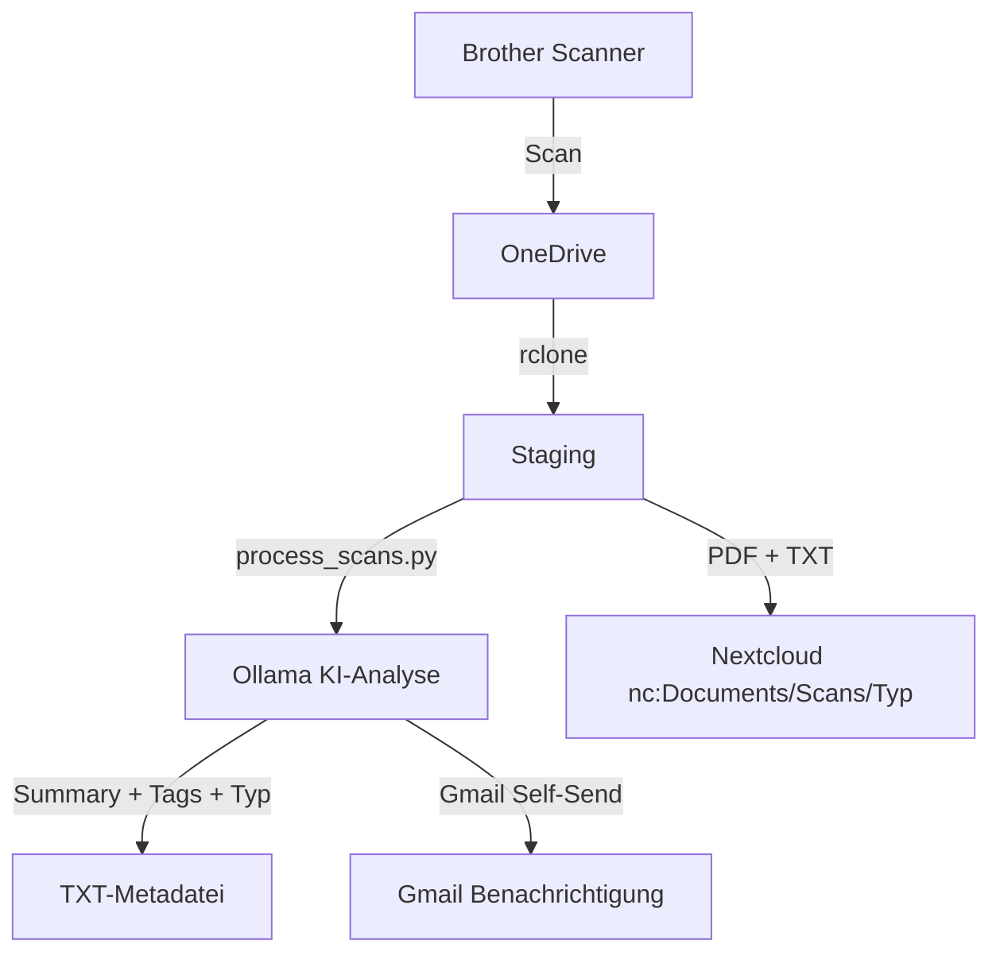
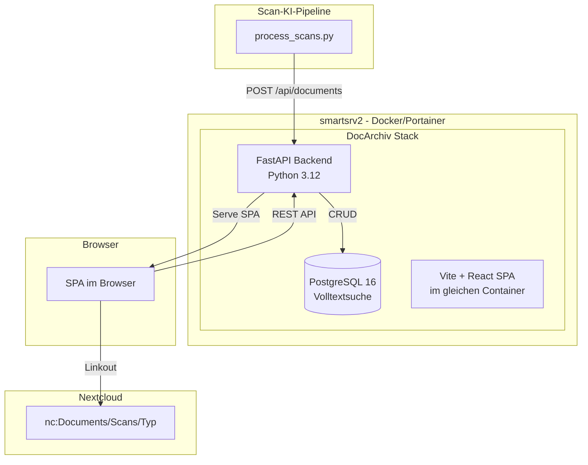
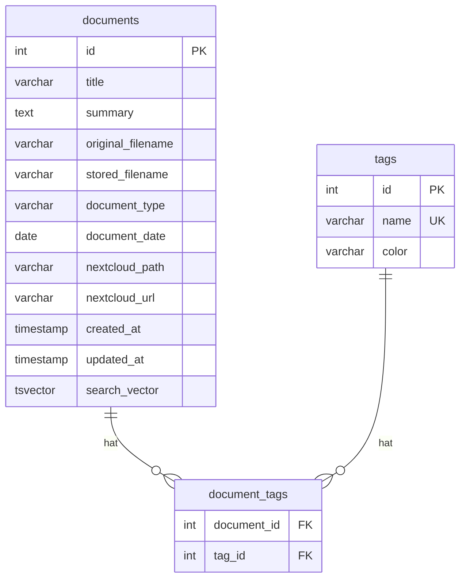
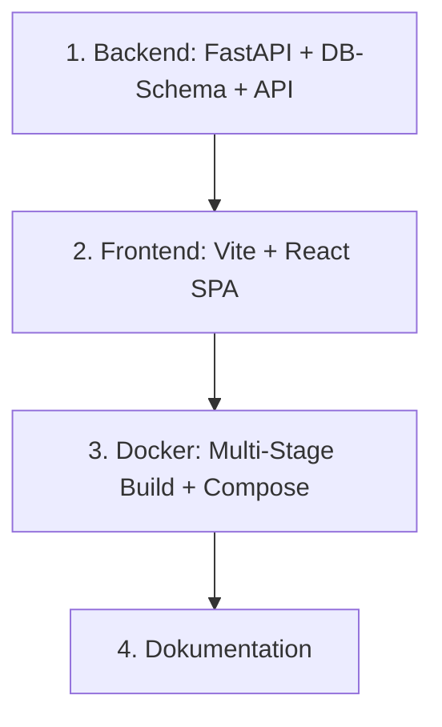

# Plan: Dokument-Archiv SPA ("DocArchiv")

> **Status:** Entwurf
> **Erstellt:** 2026-05-22
> **Ziel:** Leichtgewichtige SPA als Paperless-Ersatz – Dokumenten-Katalog mit Volltextsuche, Tagging, Nextcloud-Linkout und API für die bestehende Scan-KI-Pipeline. Ersetzt langfristig auch die Gmail-Benachrichtigung.
> **Repo:** Eigenes GitHub-Repository (wie Panasonic, ColoringPage)
> **Design:** Modernes, cleanes UI im EnBW-Stil (Blau/Grün-Akzente, klare Typografie, Card-basiert)

---

## 1. Ist-Zustand

### Scan-Pipeline heute



**Probleme:**
- **Kein durchsuchbarer Katalog** – Dokumente liegen als Dateien in Nextcloud, Suche nur über Dateinamen
- **Gmail als Benachrichtigung** – soll perspektivisch weg; die SPA übernimmt die Rolle des Archivs
- **Paperless war zu bloated** – Container abgeschaltet, kein Ersatz vorhanden

### Vorhandene Metadaten pro Dokument

Die KI-Pipeline erzeugt bereits strukturierte Daten (siehe `process_scans.py`):

| Feld | Beispiel |
|------|----------|
| `summary` | Rechnung der Stadtwerke für Mai 2026, Strom und Gas |
| `tags` | rechnung, stadtwerke, strom, haus |
| `suggested_filename` | 2026-05-20_rechnung-stadtwerke |
| `document_date` | 2026-05-20 |
| `document_type` | Rechnung |
| `original_filename` | scan_001.pdf |
| `nextcloud_path` | Rechnung/2026-05-20_rechnung-stadtwerke.pdf |

---

## 2. Ziel-Architektur



### Kernprinzipien

1. **Katalog, nicht Speicher** – Die SPA ist ein Index/Katalog. PDFs bleiben in Nextcloud.
2. **API-first** – Die Scan-Pipeline legt Dokumente per REST API an. Die SPA konsumiert dieselbe API.
3. **Leichtgewichtig** – Ein Docker-Stack mit 2 Containern (App + PostgreSQL). Kein Nginx, kein Redis, kein Celery.
4. **Kein Auth** – Nur im LAN erreichbar, kein Login nötig.

---

## 3. Tech-Stack

| Komponente | Technologie | Begründung |
|------------|-------------|------------|
| **Backend** | Python 3.12 + FastAPI | Passt zum Ökosystem, async, schnell, OpenAPI-Doku gratis |
| **Datenbank** | PostgreSQL 16 | Volltextsuche mit `tsvector`, robust, zukunftssicher |
| **ORM** | SQLAlchemy 2.0 + Alembic | Migrations, typisiert, bewährt |
| **Frontend** | Vite + React + TypeScript | Wie ehemaliger ResortPass, schnell, SPA |
| **UI-Bibliothek** | Mantine v7 | Leichtgewichtig, gute Suche/Filter-Komponenten, einfach thematisierbar |
| **Design-System** | EnBW-inspiriert | Blau-Primaer #003B7E, Gruen-Akzent #00A550, cleane Typografie, Card-Layout |
| **Container** | Multi-Stage Dockerfile | Build: Node fuer SPA → Runtime: Python served statische Dateien |
| **Port** | 8088 | Frei auf smartsrv2 |
| **Repository** | Eigenes GitHub-Repo | Wie Panasonic, ColoringPage – eigener Release-Zyklus |

---

## 4. Datenbankschema



### PostgreSQL Volltextsuche

```sql
ALTER TABLE documents ADD COLUMN search_vector tsvector
  GENERATED ALWAYS AS (
    setweight(to_tsvector('german', coalesce(title, '')), 'A') ||
    setweight(to_tsvector('german', coalesce(summary, '')), 'B') ||
    setweight(to_tsvector('german', coalesce(original_filename, '')), 'C')
  ) STORED;

CREATE INDEX idx_documents_search ON documents USING GIN (search_vector);
```

---

## 5. REST API

| Methode | Pfad | Zweck |
|---------|------|-------|
| GET | /api/documents | Liste mit Suche, Filter, Pagination |
| GET | /api/documents/{id} | Einzelnes Dokument |
| POST | /api/documents | Neues Dokument anlegen |
| PUT | /api/documents/{id} | Dokument aktualisieren |
| DELETE | /api/documents/{id} | Dokument loeschen |
| GET | /api/tags | Alle Tags mit Dokumentanzahl |
| POST | /api/tags | Neuen Tag anlegen |
| GET | /api/documents/types | Alle Dokumenttypen |
| GET | /api/health | Health-Check |

---

## 6. Umsetzungsreihenfolge


